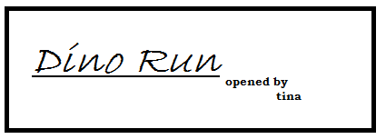

# Tina
It is voice based virtual assistant, it is used to automate the tasks.
Tina makes you to fell comfort and also it control and access the pc or laptop

# Run prog
collect_data.py
## executes
main.py
# Functionality
- Search on Wikipedia 
- Open chrome browser 
- Check whether details 
- Play music
- Tells date and time 
- Send mail using SMTP protocol
- Open file in windows explorer
- Take a snap from webcam 
- Image to text
- Send file to android device 
- Send website to android device
- Translate the string to English 
- Virtual mouse 
- Closes the program
- Send notifications
- latest version of software 
- facial identifcaton
- play dino game

# Dependencies
Require 3.x python, installing all required packages, XAMPP Apache server

# Tesseract
[download tesseract by clicking here](https://digi.bib.uni-mannheim.de/tesseract/tesseract-ocr-w64-setup-v5.0.0-alpha.20191030.exe)
It is used img_to_test.py , install in local system and add .exe file path in the file

# Send files
The files and website will be displayed in mobile ph by scanning the displayed QR code

# Dino game

